<h2>Hi, I'm Seeron Sivashankar </h2>

    

I'm a **Founding Software Engineer @ SciMynd** and a Computer Engineering student at the **University of Toronto**. I live somewhere between AI systems, hardware, and shipping products fast — and on weekends I build at hackathons (and lately keep winning them).

🎓 Computer Engineering @ University of Toronto (2024–2028)  
🛠️ Founding Software Engineer @ SciMynd — Studio, Dashboards & AI eval pipelines  
🏆 Hackathon wins: LA Hacks, GenAI Genesis & Hack Canada  
🚀 Next up: Y Combinator Startup School  
🧠 Finding ways to break the limits  

 

## 📊 GitHub Stats

  
  

## ⭐️ Projects

<table>
  <tbody>
    <tr>
      <td><a href="https://github.com/seeron6/module-library"><b>🧩 Module Library</b></a></td>
      <td>A self-growing modular TypeScript framework — daily automation ships one backend module, one headless UI, and one DX/DevOps package every 24 hours.</td>
    </tr>
    <tr>
      <td><a href="https://github.com/seeron6/forge-admin"><b>🎛️ Forge · Admin Panel</b></a></td>
      <td>Resource browser with role-based access control, impersonation, and bulk actions.</td>
    </tr>
    <tr>
      <td><a href="https://github.com/seeron6/forge-auth"><b>🔐 Forge · Auth &amp; Sessions</b></a></td>
      <td>OAuth, SAML, magic links, sessions, and step-up authentication flows.</td>
    </tr>
    <tr>
      <td><a href="https://github.com/seeron6/forge-billing"><b>💳 Forge · Billing &amp; Metering</b></a></td>
      <td>Usage-based metering with Stripe, proration, and grace periods.</td>
    </tr>
    <tr>
      <td><a href="https://github.com/seeron6/forge-search"><b>🔎 Forge · Search &amp; Indexing</b></a></td>
      <td>Hybrid keyword + vector search with reindex pipelines.</td>
    </tr>
    <tr>
      <td><a href="https://github.com/seeron6/SeeronDevPortfolio"><b>🌐 Portfolio &amp; Journal</b></a></td>
      <td>My personal site — what I'm building, breaking, and shipping, newest first. <a href="https://seeronsivashankar.com">seeronsivashankar.com</a></td>
    </tr>
  </tbody>
</table>

<!--
  The portrait on the right is an animated ASCII SVG generated from
  source-photo.jpg (white on dark themes, black on light). Regenerate with:
    pip install -r scripts/requirements.txt
    python scripts/prep_photo.py source-photo.jpg
    python scripts/make_ascii_svg.py
-->
