<h2>Hi, I'm Seeron Sivashankar </h2>

    

I'm a **Founding Software Engineer @ SciMynd** and a Computer Engineering student at the **University of Toronto**. I live somewhere between AI systems, hardware, and shipping products fast. On weekends I build at hackathons, and lately I keep winning them.

🎓 Computer Engineering @ University of Toronto (2024–2028)  
🛠️ Founding Software Engineer @ SciMynd · Studio, Dashboards & AI eval pipelines  
🏆 Hackathon wins: LA Hacks, GenAI Genesis & Hack Canada  
🚀 Next up: Y Combinator Startup School  
🧠 Finding ways to break the limits  

 

## 📊 GitHub Stats

  
  

## 🏆 Projects

<table>
  <tbody>
    <tr>
      <td width="235"><a href="https://github.com/akashngb/49th"><b>🏆 49th</b></a> 3rd Place + Google AI Track · Hack Canada</td>
      <td>A WhatsApp-native AI assistant that turns messy conversation into structured newcomer roadmaps, powered by Gemini 2.5 Flash with Playwright and Claude Vision extraction.</td>
    </tr>
    <tr>
      <td><a href="https://github.com/akashngb/revenant"><b>🏆 Revenant</b></a> Most Efficient Memory · GenAI Genesis</td>
      <td>A human-reviewed knowledge-promotion system that surfaces high-signal engineering patterns across a team, with Tavus and ElevenLabs voice mentorship.</td>
    </tr>
    <tr>
      <td><a href="https://github.com/SehreenB/ttsky-NanoTrade"><b>🏆 NanoTrade ASIC</b></a> 3rd Place Overall · UofT IEEE Hackathon</td>
      <td>A hardware-native market-surveillance engine that detects financial anomalies at the silicon level, hitting 80ns detection latency in Verilog (Sky130 / TinyTapeout).</td>
    </tr>
    <tr>
      <td><a href="https://github.com/Preet37/SAGE"><b>🏆 SAGE</b></a> Cloudinary Track · LA Hacks</td>
      <td>A multi-agent Socratic learning network that orchestrates complex reasoning across a decentralized node architecture, with Cloudinary-optimized multimodal results.</td>
    </tr>
    <tr>
      <td><a href="https://github.com/seeron6/module-library"><b>🧩 Module Library</b></a></td>
      <td>A self-growing modular TypeScript framework whose daily automation ships one backend module, one headless UI, and one DX/DevOps package every 24 hours.</td>
    </tr>
    <tr>
      <td><a href="https://github.com/seeron6/SideQuest"><b>🗺️ SideQuest</b></a></td>
      <td>A location-aware iOS app built with React, Capacitor, and Gemini that turns the places around you into gamified side-quests.</td>
    </tr>
  </tbody>
</table>
